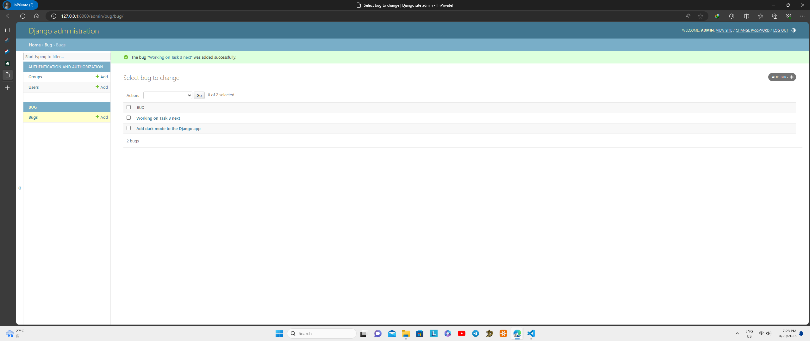
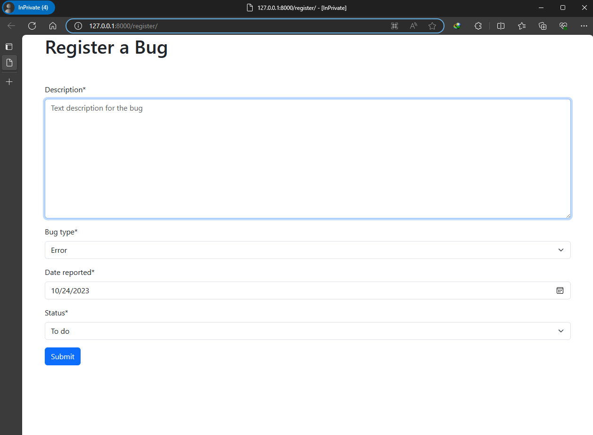
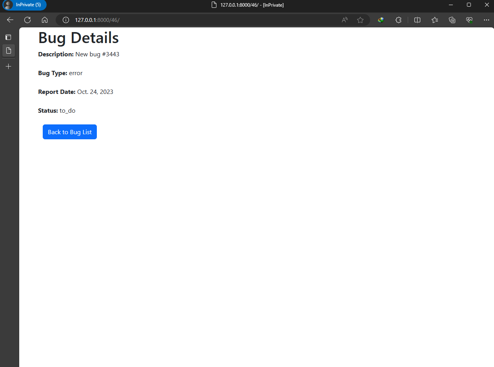
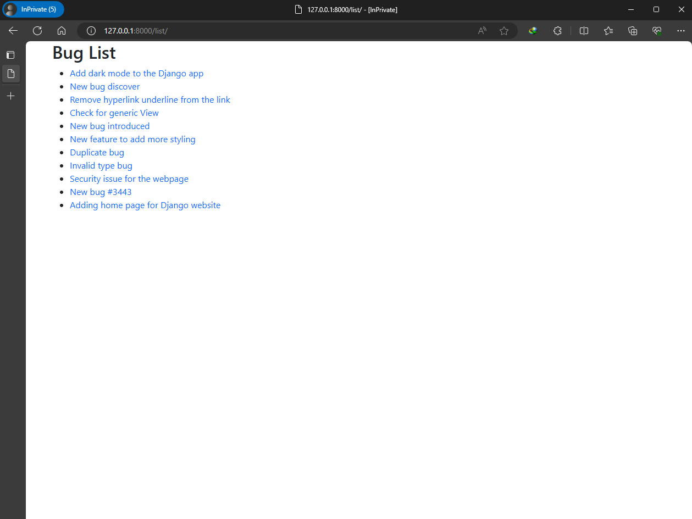
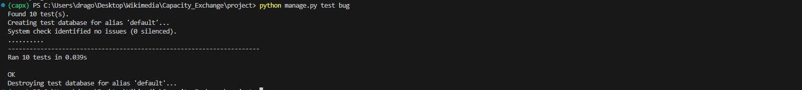

# Assist Capacity Exchange Development


## Prerequisites:

1. Download Python from official ( Python 3.8 or later for Django 4.2)
https://www.python.org/downloads/

>    Note: To check which Python version to use with Django 
>       https://docs.djangoproject.com/en/4.2/faq/install/#faq-python-version-support
2. Download pip (if using venv, it is included)
   ```bash
   python3 -m pip install --upgrade pip
   ```
3. Download Django (can download when in venv)
4. **Optional**: Use Django crispy form with Bootstrap 5 
   
> Refer to github repo here to use it: 
>  https://github.com/django-crispy-forms/crispy-bootstrap5/tree/main

### Setup in your machine:
1. Clone using git command at terminal *OR* download `zip` by clicking `<>code` button on my github repository and choose `Download ZIP` to your computer then open it using IDE
    ```bash
    git clone https://github.com/TuckWai97/Assist-Capacity-Exchange-Development.git
    ```
2. change directory into `Assist-Capacity-Exchange-Development`
   ```bash
   cd Assist-Capacity-Exchange-Development
   ```
3. Create a virtual environment to isolate project dependencies
   ```bash
   python -m venv env
   ```
    >    env is your virtual environment name, you can name it as you wish.

4. Activate your virtual environment
   - For Windows
      - If use command.exe
           ```bash    
           \env\Scripts\activate.bat
           ```
      - Powershell
           ``` bash
            \env\Scripts\Activate.ps1
           ```
    >    'env' is your previous created virtual environment name.
    > **Note**: You can refer to documentation here: https://docs.python.org/3/tutorial/venv.html


5. Use pip to install the required dependencies and packages.
   ```bash
   pip install -r requirements.txt
   ```

6. (To be safe, run it) to create migrations for those changes
   ```
   python manage.py makemigrations
   ```

7. (To be safe, run it) To create the tables in the database before we can use them
   ```
   python manage.py migrate
   ```

## Features:

### Django Admin
1. Create a user who can login into admin site using the command:
    ``` 
    python manage.py createsuperuser
    ```
2. Enter desired username, email address, and password. You will be asked to enter your password twice, the second time as a confirmation of the first.

3. Start development server if it is not running.
    ```
    python manage.py runserver
    ```
4. Open a web browser, go to http://127.0.0.1:8000/admin/ to access it.

5. Login with superuser account that you created previously.

6. You can perform 2 actions:

    - :heavy_plus_sign: ``Add`` bug with filling up the details, then click ``Save``

    - :pencil2: ``Change`` bug details or Delete it
   > info at https://docs.djangoproject.com/en/4.2/intro/tutorial02/ near end of page

### Django website:
#### How to access the website:
1. Start the development server.
   ```
   python manage.py runserver
    ```
2. Open web browser, go to http://127.0.0.1:8000/ for home page.

3. Go to http://127.0.0.1:8000/register/ for registering a bug with description, bug_type, report_date and status.

4. Go to http://127.0.0.1:8000/<bug_id> for checking the bug details.

5. Go to [http://127.0.0.1:8000/list/](http://127.0.0.1:8000/list/) to view the bug list with link for each bug.

#### Navigation of the Django website:
- :sparkles:Home page:sparkles:(optional): Landing page with 2 buttons, `Register Bug` and `Bug List`, style with Bootstrap 5.
- Bug register page: Bug field with `Description`, `Bug type`, `Date reported` and `Status` that style with Django crispy form and Bootstrap 5.
   - `description` has short hint that describes the input field, `Text description of bug` in the text field.

   - `Bug type`: dropdown box with choices, `Error`, `New Feature`, `Enhancement`, `Security Vulnerability`, `Others`.
 
   - `Date reported`: auto detect the current date, with a data picker icon on the right, which you can select the date.

   - `Status`: dropdown box with choices, `To do`, `In progress`, `Done`, `Won't Fix`, `Duplicate`, `Invalid`.

- Bug detail page : Shows the bug details submitted with bug's description as title.

- Bug List page :Links to the submitted bugs, when click on each link, will navigate to Bug detail page.

- Django admin page : Used by admin to create, remove and modify bug.

### Automated unit test cases
- Run automated unit test with command 
  ```
  python manage.py test bug
  ```

## Tasks
## Task 1: Create a Django project and commit it to GitHub
### Objective of the task: Create a Django project with an app called bug and commit it in GitHub.
Steps:
1. Read the [first part of the Writing your first Django app](https://docs.djangoproject.com/en/4.2/intro/tutorial01/) tutorial.

2. Create a Django project with an app called bug. We recommend you use PyCharm, but if you are familiar with other IDEs, you are welcomed to use them instead.

## Task 2: Structure the database and create a model
### Objective of the task: Structure a SQLite database and create a django model for the Bug app
Steps:
1. Read the [second part of the Writing your first Django app](https://docs.djangoproject.com/en/4.2/intro/tutorial02/) tutorial.

2. Create a Bug model with the following fields: "description", "bug_type", "report_date", "status", representing, respectivelly, the textual description of the bug, the type of the bug (e.g. error, new feature etc), the date in which the bug is being registered and the status of resolution of the bug (e.g. to do, in progress, done, etc).

3. Structure the database as described in the tutorial and create at least one bug through Django Admin.

   - Output:

      - Register the bug at Django Admin.
      
   
      - View with list of bug descriptions' link.
      

## Task 3: Write views and templates.
### Objective of the task: Create views and templates to 1) register and view a bug and 2) list all bugs registered
Steps:

1. Read the [third](https://docs.djangoproject.com/en/4.2/intro/tutorial03/) and [fourth](https://docs.djangoproject.com/en/4.2/intro/tutorial04/) parts of the Writing your first Django app tutorial.

2. Create one view to register a bug into the database.
   - Create a html template with a simple form to add the bug to database.

   - Output:

       - Register bug view
       

3. Create another view to view the fields of the bug.
   - Create a html template with a simple list of the fields of the bug.

   - Output:
      
      - Bug details view
      

4. And finally, create a view to list all the bugs in the database.
   - Create a html template with a simple list with links to the detail page of each bug.

   - Output:

      - Bug list view
      

## Task 4: Develop automated unit tests
### Objective of the task: Create automated unit tests for the bug app
Steps:

1. Read the fifth part of the [Writing your first Django app](https://docs.djangoproject.com/en/4.2/intro/tutorial05/) tutorial.

2. Create at least four automated tests of the bug model.

3. Create at least three automated tests of the bug views
Output:
  - Unit test result from terminal, total 10 unit tests, 5 unit tests for bug model, 5 unit tests for bug view.
   
